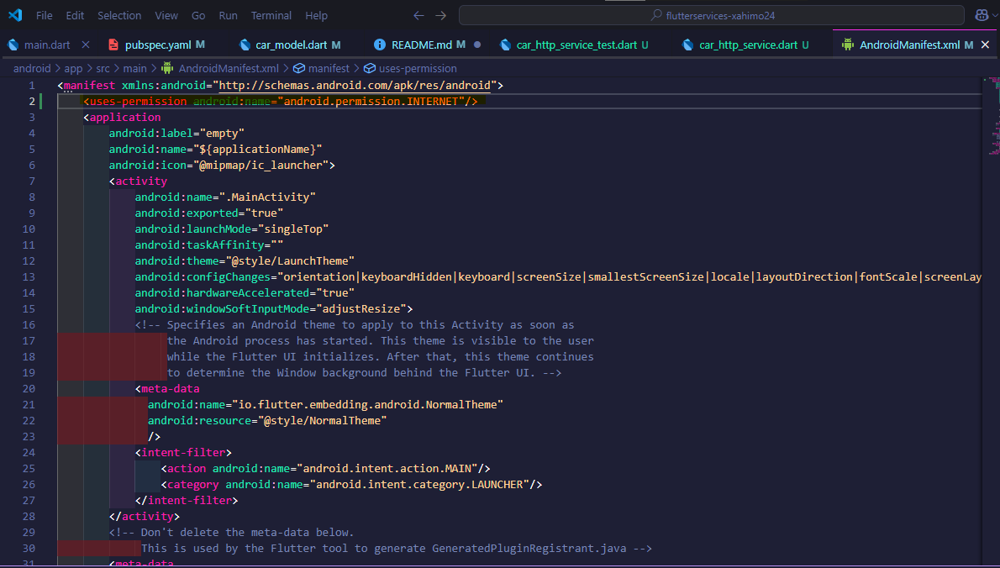

# P3b Serveis

## Exercici1: Accés a un servei

1. Afegir dependències:
   Obrim el fitxer pubspec.yaml i afegim la dependència d'http.
    

2. Creem la classe CarModel:
   Creem un nou fitxer anomenat car_model.dart dins de la carpeta lib.
   Defineixerem la classe CarModel amb els mètodes per convertir de/ a JSON:
   

3. Crear la funció per obtenir dades de l'API:
   Creem un nou fitxer anomenat car_service.dart.
   Implementem la funció per obtenir les dades de l'API:
   
   
4. Fer el test unitari
   Per permetre la connexió a internet, afegim a android-> app-> src-> main-> AndroidManifest.xml:
   
   Fem un joc de proves que executi el mètode getCars del servei i amb el que comprovem que la connexió funciona i les dades obtingudes són les que esperem.
   
   Executem la prove per veure si la fa correctament.
   

## Exercici 2: Provider

1. Afegir dependència de Provider:
   Afegim la següent dependència al pubspec.yaml:
   

2.