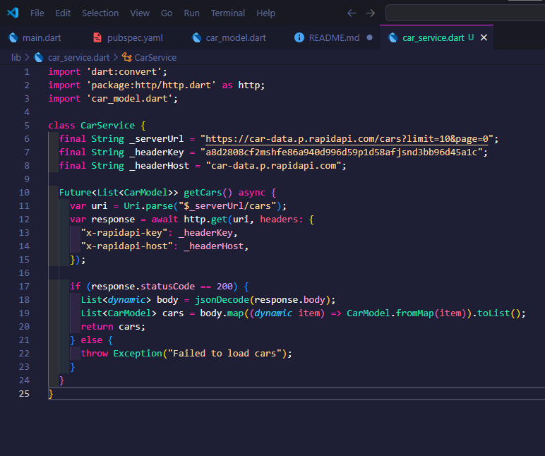
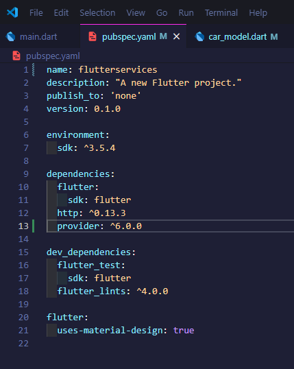

# P3b Serveis

## Exercici1: Accés a un servei

1. Afegir dependències:
   Obrim el fitxer pubspec.yaml i afegim la dependència d'http.
    

2. Creem la classe CarModel:
   Creem un nou fitxer anomenat car_model.dart dins de la carpeta lib.
   Defineixerem la classe CarModel amb els mètodes per convertir de/ a JSON:
   

3. Crear la funció per obtenir dades de l'API:
   Creem un nou fitxer anomenat car_service.dart.
   Implementem la funció per obtenir les dades de l'API:
   

4. Fer el test unitari
   Per permetre la connexió a internet, afegim a android-> app-> src-> main-> AndroidManifest.xml:
   
   Fem un joc de proves que executi el mètode getCars del servei i amb el que comprovem que la connexió funciona i les dades obtingudes són les que esperem.
   
   Executem la prove per veure si la fa correctament.
   

## Exercici 2: Provider

Respon les següents preguntes amb les mateixes paraules exactament tal i com les diuen al vídeo:
1. Qué és el que aprendrem a aquest vídeo? 
   "En este vídeo aprenderemos a manejar Un estado global de la aplicación en este paquete poderosísimo que se llama Provider"
   
2. Quina comanda es fa servir al vídeo per a crear una nova aplicació flutter?
   Al vídeo, la comanda que es fa servir per crear una nova aplicació Flutter és:
   flutter create --org com.codigocorrecto provider_counter
   
3. Com es treu el debugger banner? Afegeix la línia de codi que fan servir al vídeo per treure’l
    Al vídeo, es mostra la següent línia de codi per treure el debug banner:
    debugShowCheckedModeBanner: false,

    Aquesta línia s'afegeix dins del MaterialApp al fitxer main.dart:
    return MaterialApp(
        debugShowCheckedModeBanner: false,
        home: MyHomePage(),
    );

1. Afegir dependència de Provider:
   Afegim la següent dependència al pubspec.yaml:
   

2. Crear un Provider per a la llista de cotxes:
   Creem un nou fitxer anomenat car_provider.dart.
   Implementem el Provider:
   

## Exercici 3: Integrar vista i model

1. Creem la carpeta views i l'arxiu view_car.dart.
   

2. Configurem l'arxiu per a que es vegi el cotxes.
   

3. Un cop fet i configurat hem de configurar l'arxiu main.dart per a que crei l'aplicació i declare les variables del views_car.dart per a que es vegi.
   

4. Comprobem que funciona i es veu bé executant-el.
   

## Exercici 4: Acudits

1. Creem un arxiu nou anomenat joke_service.dart en la carpeta data:
   

2. Creem un Provider per a l'acudit:
   

3. Creem la vista per a l'acudit:
   

4. Creem el main per a l'acudit:
   
